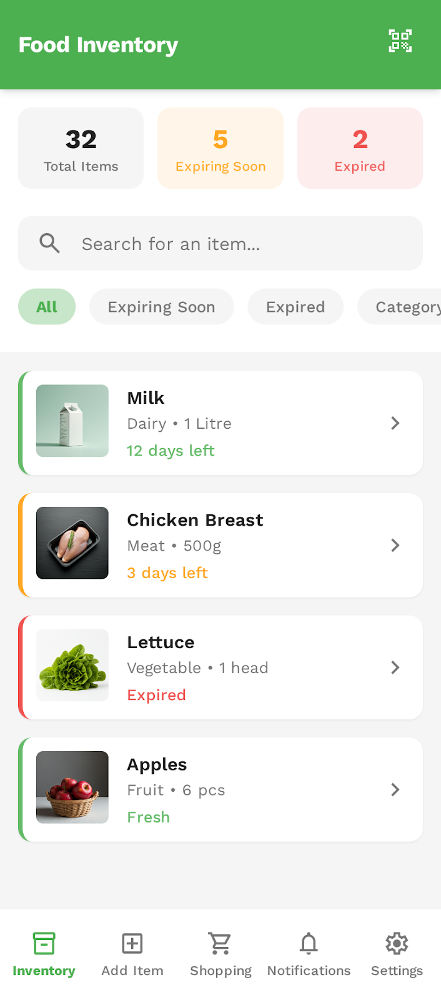
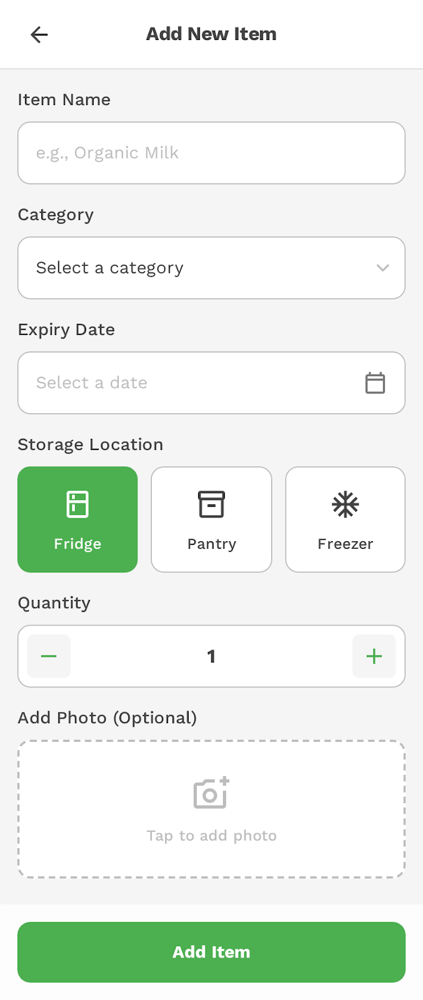
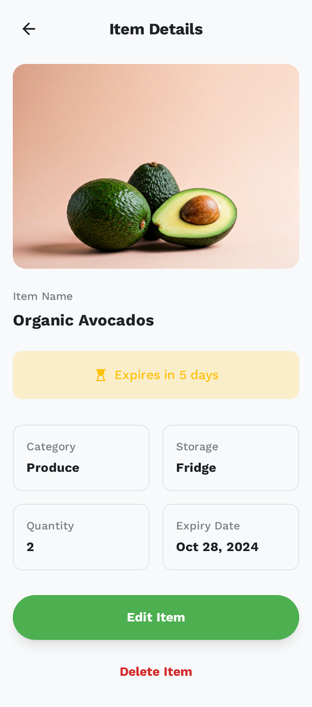
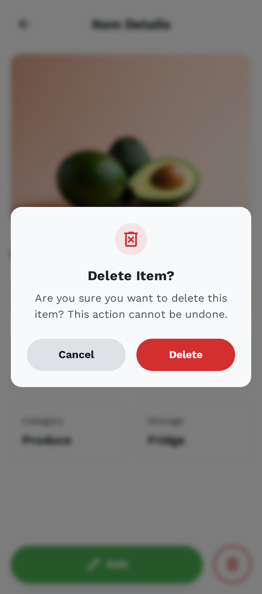
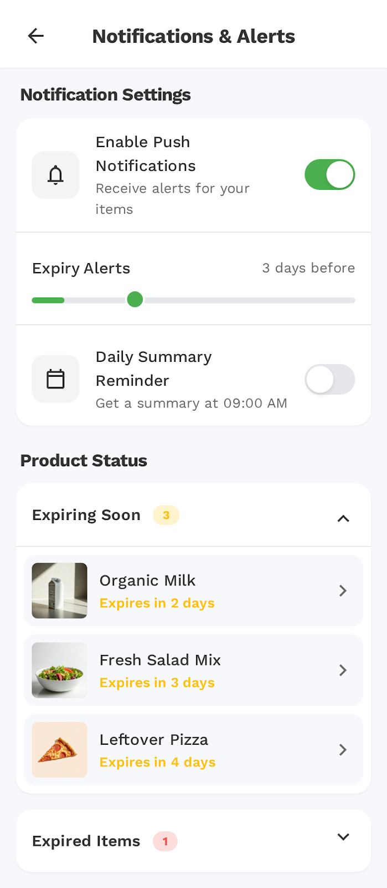

# Food Tracking App

A Flutter-based food inventory management app that helps users track their food items, monitor expiration dates, and receive timely notifications to reduce food waste.

## Screenshots

<p align="center">
  
  
  
</p>

<p align="center">
  
  
  
</p>

## Features

### Core Functionality

#### Food Inventory Management
- **View Food Items**: Browse all stored food items with detailed information including name, category, quantity, and expiration status
- **Add New Food**: Add food items to your inventory with details like name, category, quantity, purchase date, and expiry date
- **Food Details**: View comprehensive details of each food item including images and full information
- **Search & Filter**:
  - Search food items by name or category
  - Filter by status: All, Expiring Soon, Expired, or Category
- **Real-time Statistics**: Dashboard showing total items, items expiring soon, and expired items

#### Smart Notifications
- **Expiration Alerts**: Automatic notifications when food items are approaching their expiration date
- **Customizable Alert Days**: Configure how many days before expiry you want to be notified (default: 5 days)
- **Notification Management**: View and manage all scheduled notifications
- **Test Notifications**: Test notification functionality with quick test features

#### Server Integration
- **API Sync**: Refresh food inventory from external API server
- **Local Data Fallback**: Works offline with local food data when server is unavailable
- **Smart Filtering**: Filter local data based on server response for optimized inventory display

#### Settings & Customization
- **Notification Settings**: Configure notification preferences and expiry alert thresholds
- **Test Tools**: Built-in tools for testing notifications and app features

## App Architecture

### Pages & Routes

1. **Home Page** (`/`) - Main inventory dashboard
   - Food list with search and filters
   - Summary cards (Total, Expiring Soon, Expired)
   - Refresh from server functionality

2. **Add Food Page** (`/add-food`) - Add new food items

3. **Food Detail Page** (`/food-detail`) - Detailed view of individual food items

4. **Notifications Page** (`/notifications`) - View and manage notification settings

5. **Test Notifications Page** (`/test-notifications`) - Test notification functionality

6. **Quick Test Page** (`/quick-test`) - Quick notification testing tool

### Technology Stack

- **Framework**: Flutter (Dart)
- **Backend**: Firebase (Firestore)
- **Local Storage**: Local data fallback system
- **Notifications**: Firebase Cloud Messaging integration
- **State Management**: StatefulWidget with setState

### Data Management

- **Categories**: Pre-defined food categories (Fruits, Vegetables, Dairy, etc.)
- **Local Data**: `LocalFoodData` class for offline functionality
- **API Service**: `FoodApiService` for server communication
- **Repositories**:
  - `CategoryRepository` - Category management
  - `SettingsRepository` - App settings

### Services

- **InitializationService**: Handles app initialization and data setup
- **NotificationService**: Manages notification scheduling and delivery
- **FoodApiService**: Handles API communication with backend server

## Getting Started

### Prerequisites

- Flutter SDK (latest stable version)
- Dart SDK
- Firebase account and project setup
- iOS/Android development environment

### Installation

1. Clone the repository
2. Install dependencies:
   ```bash
   flutter pub get
   ```

3. Configure Firebase:
   - Add your `google-services.json` (Android) to `android/app/`
   - Add your `GoogleService-Info.plist` (iOS) to `ios/Runner/`
   - Ensure `firebase_options.dart` is properly configured

4. Run the app:
   ```bash
   flutter run
   ```

### Configuration

- **Notification Settings**: Adjust expiry alert days in Settings
- **API Endpoint**: Configure server URL in `FoodApiService`

## Usage

1. **Add Food Items**: Tap the "Add" button in the bottom navigation to add new food items
2. **Monitor Expiration**: Check the dashboard for items expiring soon or already expired
3. **Search & Filter**: Use the search bar or filter chips to find specific items
4. **Receive Alerts**: Get notifications when food is approaching expiration
5. **Sync with Server**: Tap the refresh icon to sync with the backend server

## Features in Detail

### Bottom Navigation
- **Inventory**: View all food items (Home page)
- **Add**: Add new food items
- **Shopping**: Shopping list (Coming soon)
- **Alerts**: Notification and alert settings
- **Settings**: App settings and preferences

### Status Indicators
- **Green**: Food is fresh (more than alert threshold days remaining)
- **Orange**: Food is expiring soon (within alert threshold)
- **Red**: Food has expired

## Development

### Project Structure
```
lib/
├── data/
│   ├── models/          # Data models (FoodItem, Category, etc.)
│   ├── repositories/    # Data repositories
│   ├── services/        # Business logic services
│   └── local/          # Local data management
├── features/
│   ├── home/           # Home page
│   ├── add_food/       # Add food functionality
│   ├── food_detail/    # Food detail view
│   ├── notifications/  # Notification management
│   └── settings/       # Settings and test pages
└── router/             # App routing configuration
```

## License

This project is developed as part of SUTD Term 2 Design coursework.

## Support

For issues or questions, please contact the development team.
